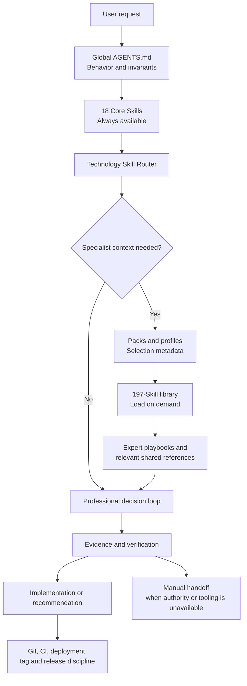

# CodexForge

**Professional Engineering Intelligence for Codex**

CodexForge is an independent modular engineering-intelligence framework for OpenAI Codex. It combines a compact core instruction system with specialist Skills, evidence-based decision workflows, context-aware routing, progressive disclosure, deployment verification, version-aware engineering guidance, and disciplined Git and release practices.

CodexForge is an independent community project and is not affiliated with or endorsed by OpenAI.

## Why CodexForge exists

General-purpose coding agents can be useful while still failing in predictable ways: agreeing with a flawed premise, sounding certain without evidence, applying shallow checklists, ignoring pinned versions, treating source files as proof of deployed behavior, loading too much specialist context, overengineering small projects, or turning every experiment into a commit, deployment, or release.

CodexForge supplies durable decision rules and focused specialist guidance so an agent can:

- challenge materially incorrect or unsafe assumptions;
- distinguish verified facts, inferences, assumptions, recommendations, unknowns, and manual-verification boundaries;
- inspect the real stack and compatibility ceiling before acting;
- load specialist knowledge only when the task calls for it;
- choose a proportional solution and verify the original success condition;
- distinguish source, build, local runtime, deployment, and external observability;
- hand account, GUI, MFA, hardware, legal, and production-only actions back honestly; and
- keep Git history, CI activity, deployments, tags, and releases meaningful.

## Current package

The repository contains the CodexForge V5.0.1 package. Counts below are derived from `manifest.json` and `packs/packs.json` and are checked by the package verifier:

- 18 Core Skills bundled in `.agents/skills/`;
- 197 specialist Skills in `skill-library/skills/`;
- 37 optional packs and 22 profiles;
- per-Skill expert playbooks and source maps;
- shared professional references;
- a technology router and progressive-disclosure model; and
- PowerShell installation, rollback, pack-management, and verification scripts.

## Principles

```text
TRUTH > AGREEMENT
EVIDENCE > CONFIDENCE
PROJECT CONTEXT > GENERIC BEST PRACTICE
VERIFICATION > ASSUMPTION
PROPORTIONAL SOLUTION > OVERENGINEERING
MEANINGFUL HISTORY > COMMIT COUNT
MEANINGFUL RELEASES > RELEASE COUNT
INTENTIONAL DEPLOYMENTS > DEPLOYMENT COUNT
```

## Architecture



Only concise Core Skill metadata is active by default. The router selects packs and specialist material from repository evidence; each specialist can then open only its relevant playbook, source map, or shared field guide. This is progressive disclosure: broad capability without placing the full library in every prompt.

See [Architecture](docs/architecture.md), [Skill system](docs/skill-system.md), and [Routing](docs/routing.md).

## Install on Windows

### Prerequisites

- OpenAI Codex with access to the user-level `.codex` and `.agents` directories.
- Windows PowerShell 5.1 or a compatible PowerShell environment.
- An extracted or cloned copy of this repository.

Open Windows PowerShell in the repository root and run:

```powershell
Set-ExecutionPolicy -Scope Process Bypass
.\verify-package.ps1
.\install-update.ps1 -WhatIf
.\install-update.ps1
.\verify-install.ps1
.\verify-active-budget.ps1
```

What each command does:

1. `Set-ExecutionPolicy -Scope Process Bypass` permits local scripts only for the current PowerShell process; it does not persist a machine- or user-wide policy change.
2. `verify-package.ps1` checks Skill counts, required Skill files, pack/profile references, stale V4 operational paths, PowerShell parsing, ASCII safety, and the Core metadata budget.
3. `install-update.ps1 -WhatIf` previews installation without creating a backup or changing managed directories.
4. `install-update.ps1` backs up the current global instructions and active Skills, installs V5.0.1, and resets CodexForge-managed active Skills to the Core set. Unmanaged Skill directories are preserved.
5. `verify-install.ps1` checks the installed global instructions, specialist library, expert playbooks, shared references, and Core Skills.
6. `verify-active-budget.ps1` reports the active Skill count and estimated discovery-metadata footprint.

Restart Codex after installation. For expanded instructions, verification, and rollback details, see [Installation](docs/installation.md).

## Use packs and profiles

The installer places the pack manager at:

```powershell
$manager = Join-Path $HOME '.codex-engineering-system\v5\codex-pack.ps1'
& $manager list
& $manager status
& $manager profile web-typescript
& $manager auto -ProjectPath 'C:\path\to\project'
& $manager reset
```

`auto` uses repository evidence and falls back to the Core set when it cannot confidently detect a relevant pack. Restart Codex if the active Skill list does not refresh after a pack change.

## Example requests

- “Review this authentication change. Challenge my assumptions and separate authentication from authorization.”
- “This app is pinned to Visual Studio 2010. Diagnose the build failure without using newer VB syntax.”
- “Verify whether the deployed favicon is really an image response, not an SPA fallback.”
- “Analyze this dataset, state data-quality limits, and do not imply causation from correlation.”
- “Clean up this branch into coherent commits, but do not create a release for every deployment.”

See the [examples](examples/) and [evaluation scenarios](tests/scenarios/) for concrete expected behavior. These scenarios are specification tests; they do not prove model behavior unless they are actually executed against a model and evaluated.

## Documentation

- [Architecture](docs/architecture.md)
- [Design principles](docs/design-principles.md)
- [Installation and rollback](docs/installation.md)
- [Skill system](docs/skill-system.md)
- [Technology routing](docs/routing.md)
- [Evidence model](docs/evidence-model.md)
- [Manual handoff](docs/manual-handoff.md)
- [GitHub workflow](docs/github-workflow.md)
- [Compatibility](docs/compatibility.md)
- [Project history](HISTORY.md) and [changelog](CHANGELOG.md)
- [Verification report](STATIC_QA_REPORT.md)

## Contributing and security

Read [CONTRIBUTING.md](CONTRIBUTING.md) before proposing changes. Report suspected vulnerabilities using the private process in [SECURITY.md](SECURITY.md), not a public issue.

## License

CodexForge is licensed under the Apache License 2.0.

See the [LICENSE](LICENSE) file for the full license terms.

Attribution and project notices are available in [NOTICE](NOTICE).

CodexForge is an independent community project and is not affiliated with or endorsed by OpenAI.

## Disclaimer

CodexForge is an independent community project and is not affiliated with or endorsed by OpenAI. It provides engineering guidance, not a guarantee of correctness, security, compliance, compatibility, or production readiness. Verification remains specific to the repository, environment, and action being evaluated.
