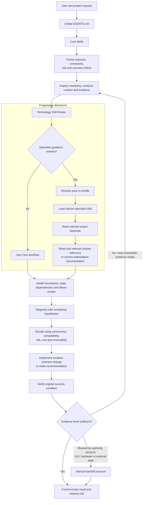
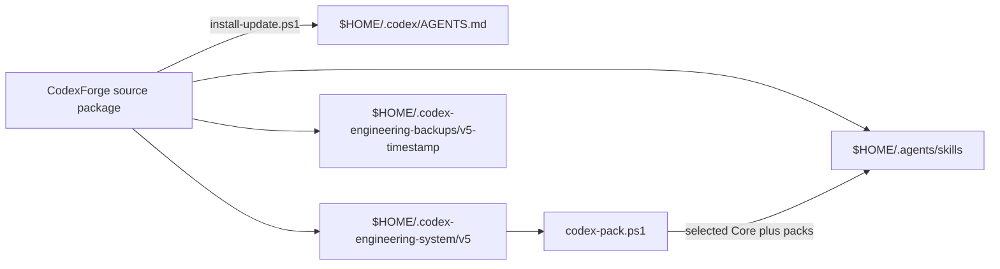

# Architecture

CodexForge separates always-visible operating rules from on-demand specialist depth. The source package and installed runtime use the same conceptual layers, but not the same physical destinations.

## System flow

The diagram is a decision flow, not a promise that every task requires every layer. A small documentation correction may use only Core guidance. A version-sensitive production incident may require a specialist Skill, its expert playbook, a field reference, current official documentation, and runtime evidence.

## Source-package boundaries

| Path | Role |
| --- | --- |
| `.codex/AGENTS.md` | Global behavior and cross-cutting invariants installed for Codex. |
| `.agents/skills/` | The 18 bundled Core Skill copies installed as the default active set. |
| `skill-library/skills/` | The complete 197-Skill library. Each Skill owns its `SKILL.md` and relevant references. |
| `skill-library/shared-references/` | Reusable evidence, compatibility, handoff, Git/release, and domain field guides. |
| `packs/packs.json` | Source of truth for the Core list, 37 pack definitions, and 22 profiles. |
| `codex-pack.ps1` | Lists, enables, disables, resets, profiles, or auto-detects packs after installation. |
| `install-update.ps1` | Backs up current user configuration and installs the V5.0.1 layout. |
| `verify-*.ps1` | Checks the source package, installed state, and active metadata budget. |
| `project-template/` | Optional project-local instructions and documentation templates. |

Core Skills are not duplicated under a cosmetic `core/` directory, and profiles are not copied into a cosmetic `profiles/` directory. Those alternatives would create multiple sources of truth and would not match the current installer.

## Installed boundaries

The installer removes and replaces only destinations whose names occur in the CodexForge manifest. It backs up the previous global `AGENTS.md` and active Skills before a real install; `-WhatIf` is designed to be side-effect free.

## Invariants

- `manifest.json` defines version `5.0.1`, the 197-Skill inventory, and the 18-Skill Core inventory.
- `packs/packs.json` defines Core selection, packs, and profiles consumed by both verification and pack management.
- The installed specialist library remains under `.codex-engineering-system/v5/`; the V5 path is operational and must not be renamed for branding.
- The active Core set remains compact. Specialist context is selected from evidence rather than globally activated.
- A specialist's `SKILL.md` is the entry point; deeper references are opened only when relevant.
- Source inspection does not imply build, runtime, deployed, or external-observable verification.
