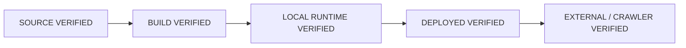

# Evidence model

CodexForge separates confidence from proof. A source file, successful build, local response, deployed endpoint, and third-party observation are different evidence levels.

| Level | Required evidence |
| --- | --- |
| Source verified | The relevant source, configuration, or declaration exists and is internally consistent. |
| Build verified | The production build includes or transforms the resource as expected. |
| Local runtime verified | A local runtime serves or uses the built result correctly. |
| Deployed verified | The intended deployed URL or service returns the expected status, redirects, headers, content type, and body. |
| External/crawler verified | The relevant external client, crawler, integration, or platform can observe and process the deployed result. |

Higher levels require their own evidence. They cannot be inferred from a lower level.

## Generic favicon example

A favicon existing at `public/favicon.ico` proves only a source-level fact. It does not prove that `https://example.com/favicon.ico` returns a valid icon in production.

A complete check should inspect:

1. the icon reference in rendered HTML or the framework's generated metadata;
2. the final URL resolved against the deployed origin and any base path;
3. the HTTP status and redirects;
4. the returned `Content-Type` and file signature;
5. whether a missing asset is being hidden by an HTML or SPA fallback that still returns `200`;
6. the asset's actual format and relevant dimensions;
7. robots or crawler access where applicable; and
8. whether the public URL is stable and canonical.

Even a correct deployed icon does not guarantee when or whether a search engine or social platform will refresh its cache. That last observation belongs to the external level.

## Resources that need the same discipline

- `robots.txt` and `sitemap.xml`;
- Open Graph and social-preview images;
- web manifests and manifest icons;
- canonical and structured-data URLs;
- ownership or service-verification files;
- redirects and public downloads;
- public APIs, webhooks, DNS/TLS, and OAuth callbacks.

Report each relevant level as **PASS**, **FAIL**, or **NOT VERIFIED**, and state the observation behind it. An HTTP `200` alone is not enough when content identity matters.
