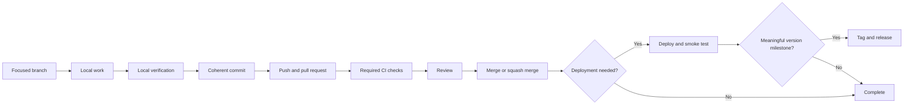

# Git, GitHub, deployment, and release workflow

AntigoStack treats repository events as distinct lifecycle operations:

```text
file edit != commit != push != pull request != CI run != deployment != tag != release
```

Each event should exist for a concrete reason.

## Professional rules

- Keep AI experimentation local when practical; do not commit every debugging attempt.
- Create coherent commits that form useful review and rollback boundaries.
- Run deterministic local checks before pushing merely to obtain remote feedback.
- Use branches and pull requests when collaboration, review, or repository maturity warrants them.
- Squash noisy branch history when repository policy permits and individual attempts are not useful history.
- Preserve meaningful checkpoints when they independently explain a design or migration step.
- Use a remote deployment when remote-only behavior—such as DNS, provider environment, OAuth callbacks, CDN behavior, or production networking—must be tested.
- Trace deployment creation to its trigger and avoid duplicate provider and workflow integrations.
- Use concurrency cancellation for obsolete branch/preview CI where safe; do not cancel production or release work blindly.
- Create tags and GitHub Releases only for meaningful versioned milestones.
- Never fabricate commit history or dates.
- Never force-push, rewrite shared history, or delete branches, tags, releases, or unique artifacts without explicit authorization and recovery evidence.

## Recommended flow



For an empty single-maintainer repository, one verified initial commit on `main` can be proportional. Once collaboration or public contribution begins, protected `main`, focused branches, pull requests, and required checks become the stronger default.

## Commit messages

Examples of descriptive Conventional Commit-style messages:

```text
feat(router): improve specialist skill selection
fix(web): verify deployed favicon URL
docs(vb): document Visual Studio 2010 compatibility
test(agent): add anti-sycophancy scenario
feat(git): add release-discipline guidance
```

Commit style is a communication tool, not a substitute for meaningful content.

## Release criteria

A release can represent a distributed package, public beta, compatibility change, security/maintenance update, or other versioned milestone users need to reason about. A deployment, documentation typo, or arbitrary activity count is not automatically a release.
